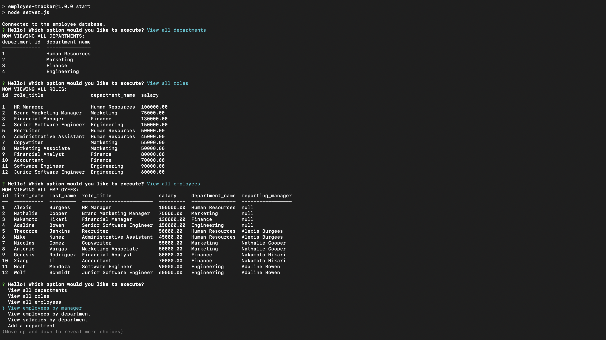

# Nodebase 2.0 🗄

[](https://opensource.org/licenses/MIT)

## Description
This server-side command-line interface application utilizes JavaScript, Node.js, and Node Package Manager (Inquirer, MySQL2, console.table, dotenv) to view, add, update, and delete employee information in a SQL database.

## Table of Contents
  - [Installation](#installation)
  - [Usage](#usage)
  - [Preview](#preview)
  - [License](#license)
  - [Contribution](#contribution)
  - [Questions](#questions)
  - [Credits](#credits)

## Installation
- To install, clone this repository onto your local computer, open it in your code editor, and run the following command on your terminal: ```npm install```

- Before starting up the program, create a .env file at the root level of this project with the following content:
    - db_name = employees
    - db_user = <'mysql-username-here'> (If no username is set, default user for SQL is 'root')
    - db_pw = <'mysql-password-here'> (If no password is set, by default SQL has no password)

## Usage
- Once all packages have been installed, run the mysql shell command ```mysql -u root -p``` and enter your password before running ```source db/schema.sql``` and then ```source db/seeds.sql```. Once completed, type ```exit```.

- After exiting the mysql shell, run the command ```npm start```, ```npm run start``` OR ```node server.js``` on your terminal and answer the displayed prompts as they appear. 

https://user-images.githubusercontent.com/96617237/168521937-f520573f-a91e-4d44-a490-38e749191ad0.mp4

## Preview


## License
- This project is licensed under: [MIT](https://opensource.org/licenses/MIT)

## Contribution 
- Forking this repository is always welcomed and encouraged!

> If you encounter a problem with this application, please add an issue or pull request to the GitHub repository. 

## Questions
- Please feel free to use this application at any time and visit my personal [GitHub](https://github.com/denysha-abigail) profile to access other open source projects! 

## Credits
- *[Denysha Guerrios-Armaiz](https://github.com/denysha-abigail), 05/2022*
